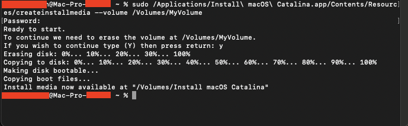

# Msi X570 A-Pro OPENCORE 0.6.6
Central point on making everything working on Motherboard Msi A-Pro X570

[Msi X570 A-Pro Specifications](https://www.msi.com/Motherboard/X570-A-PRO/Specification)

## Specs:
| Component | Brand | Price |
|:--- |:---:|:--- |
| Motherboard:  | Msi A-Pro X570 | 169.99$ |
| CPU: | AMD Ryzen 9 3900X | 484.00$ |
| GPU: | Msi Mech OC 5700XT 8GB | At that time just 390$, now there is any GPU online... |
| Memory: | HyperX 3200MHz x2 8GB | 129$ |
| Power Supply: | NZXT 750W | 139$ |
| Case: | NZXT 510 | 84,99$ |

### Working
- [x] **Tested with macOS Big Sur 11.1 and 11.2.1**
- [x] **Bluetooth:** (With a USB adapter](amazon.com))
- [x] **USB:** All internal and external ports (Thanks to SSDT-EC-USBX-LAPTOP.aml)
- [x] **Ethernet:** Realtek RTL8111 (Thanks to RealtekRTL8111.kext
- [x] **HDMI, DisplayPort:** Works perfect. 
- [x] **Shutdown:** Yes
- [x] **Restart:** Yes
- [x] **Sleep/Wake:** Yes

### Not working
- Continuity Features
- Some software due the limitations of an AMD CPU.


```bash
```
# INSTALLATION GUIDE
```bash
```
## Creating Booteable USB

### From macOS:
[*Installation Guide Apple Page*](https://support.apple.com/en-us/HT201372)

**Download installers:** [Big Sur](https://itunes.apple.com/us/app/macos-big-sur/id1526878132) - [Catalina](https://itunes.apple.com/us/app/macos-catalina/id1466841314)

1. Connect a <=16 GB pendrive.
2. Open *Disk Utility* and Erase the USB with the name: *MyVolume*.
3. Open *Terminal* and use the proper commands for your macOS installer:
- Big Sur: `sudo /Applications/Install\ macOS\ Big\ Sur.app/Contents/Resources/createinstallmedia --volume /Volumes/MyVolume`
- Catalina: `sudo /Applications/Install\ macOS\ Catalina.app/Contents/Resources/createinstallmedia --volume /Volumes/MyVolume`



### From Windows:

[**Dortania's Guide**](https://dortania.github.io/OpenCore-Install-Guide/installer-guide/winblows-install.html)

```bash
```
# BIOS Settings:
- Make Sure you have [Latest BIOS](https://www.msi.com/Motherboard/support/X570-A-PRO#down-bios)

in process..
